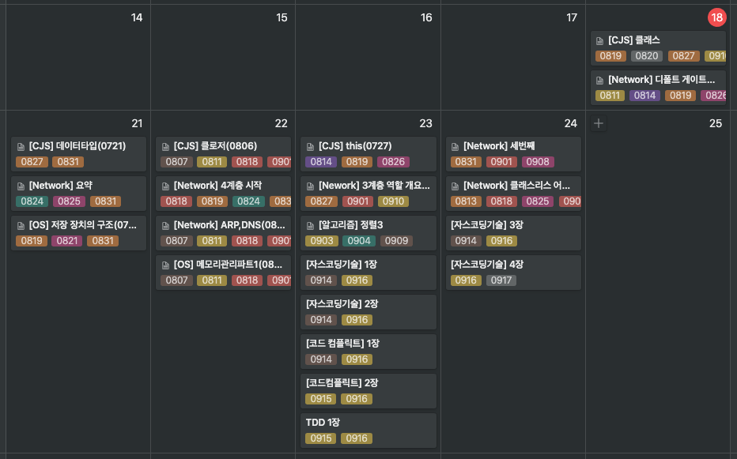

# 📚 퀴즈와 함께 공부한 내용 기록하기

모든 부분이 아닌 **필요한 부분**만 정리하고 추가로 **내 생각**이 적는다.

## Rules

- 모든 챕터에 **퀴즈**가 존재해야한다.

- 각 챕터가 새로 작성되면 **스케줄표에 등록**되어 **복습**을 진행해야한다.

- 복습 주기는 퀴즈에 대한 답을 명확하게 대답 못하는 개수에 따라 정해진다.

## Index

### javascript coding skill

- [변수할당으로 의도를 표현하라](/javascript-coding-skill/chapter01.md)
- [배열로 데이터 컬렉션을 관리하라](/javascript-coding-skill/chapter02.md)
- [특수한 컬렉션을 이용해 코드 명료성을 극대화하라](/javascript-coding-skill/chapter03.md)
- [조건문을 깔끔하게 작성하라](/javascript-coding-skill/chapter04.md)
