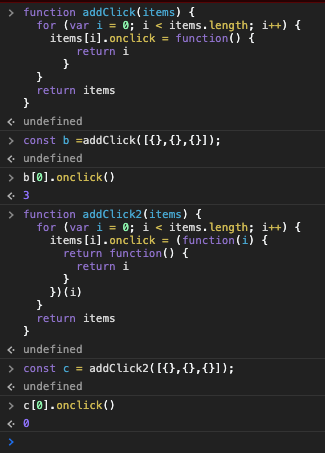

# 변수할당으로 의도를 표현하라

```text
created: 2020-09-11 21:59:59
updated: 2020-09-11 21:59:59
```

```text
<Quiz>
  1. const, value, let의 차이를 말하시오.
  2. 위 키워드들은 어떤 스코프를 가지나요.
  3. let, const가 나온 이유에 대해서 아는데로 말하시오.
  4. 호이스팅이 무엇인가요.
  5. 리터럴 템플릿이란 무엇인가요.
  6. 왜 var 대신 const,let을 사용하면 좋은지 예를 들어보시오.
</Quiz>
```

## const로 변하지 않는 값을 표현하라

예를들어서 코드를 작성하는 부분에서는 10만 줄의 긴 코드가 있다고 가정할 때, `var 키워드`로 변수를 선언하는 방법과

`const 키워드`로 변수를 선언하는 방법은 큰 차이가 있다.

만약 10만 줄의 코드에서 변수가 중간에 변경 되어버리면 그 부분을 찾기가 어려워서 유지보수하기 어려운 코드로 점점 가게 된다.

`const`는 재할당이 불가능하지만, `var`은 재할당이 가능하다.

예로 `var move` 로 변수를 선언하게 되면, 중간 코드쪽에서 `move`를 재할당해버리면 `move`가 원래 동작데로 돌아가지 않을 것이다.

> 참고로 const 는 재할당은 할 수 없지만, 값이 객체라면 객체의 값은 바꿀 수 있다.

## let과 const로 유효 범위(스코프) 충돌을 줄여라

일단 var는 렉시컬 스코프 또는 함수 스코프를 따른다.

예를들어볼까?

```js
function fn() {
  var value = 10;
}

console.log(value); // (*)
```

(*)은 무엇이 나올까?

`undefined`가 나온다고 생각하면 땡!

`value is not defined`가 나온다.

변수 value는 fn()함수 내에 선언되었고, 이에 따라 함수 스코프를 따르는 var키워드로 선언한 value는 fn() 메서드 안에서 유효하다.

즉, 밖은 value의 존재를 모른다.

그러면 또 생각할 수 있는건 다음도 있다.

```js
{
  var value = 10;
}

console.log(value); // (*)
```

그럼 여기서 (*)은 무슨 값이 나올까?

`value is not defined`가 나올까? 아니다! var 키워드는 함수 스코프이니 함수 안에서만 스코프를 가진다.

저건 { 와 } 로 둘러싼 블록 안에 있는 상태이다. 그렇기 때문에 함수 안에 있는 것이 아니다.

저렇게 블록으로 감싸져있는 스코프를 블록 스코프라고 하며, 블록 스코프에 해당되는 키워드가 바로

const와 let이다.

참고로 스코프란 말은 유효범위를 말한다. 해당 변수가 어디까지 유효한지를 말하는 것이다.

자 그러면

```js
{
  let value = 10;
}

console.log(value); // (*)
```

var키워드에서 let키워드로 바꿔봤다.

그러면 (*)은 뭐가 출력이 될까?

그렇다. `value is not defined`가 뜨게 된다.

즉, let은 블록 안에서 유효하기 때문에 블록 스코프를 가진다고 말한다.

그런데 유효하다는게 무슨 뜻인지 좀 더 쉽게 풀어볼까.

해당 변수가 접근 할 수 있거나 참조 될 수 있는 범위라고 말하면 상대방이 이해하기 쉬울라나?

## 블록 유효 범위 변수로 정보를 격리하라

왜 let,const는 새로나온 주제에 블록 스코프를 가지게 했을까?

호이스팅을 방지할 수 있다!

특히 반복문에 `var 키워드`를 사용하게 되면 호이스팅으로 문제가 발생한다.

일단 여기서 호이스팅 개념을 알아야겠지~

이 개념은 다른 곳에서 다루겠지?

일단 예제로 말해볼까?

```js
var i = 10;

for (var i = 0; i < 3; i++) {
  console.log('first', i);
}

console.log('second', i);
```

이거 결과 어떻게 나올 것 같나?

```text
first 0
first 1
first 2
second 3
```

처럼 나온다. second에 출력한 결과값을 보자. 10이 나와야되는데... 3이 나와버린다.

이 현상은 호이스팅이 일어났기 때문인데, 호이스팅이란 var키워드로 선언한 변수는 위로 변수명(식별자명)이 위로 끌어올려지는 현상을 말한다. 그래서 위 코드는 다음 처럼 실행하게 된다.

```js
var i = 10;

for (i = 0; i < 3; i++) {
  console.log('first', i);
}

console.log('second', i);
```

그래서 이를 방지하기 위해서 let, const를 사용하자. 물론 여기서 변수값이 바뀌어야되니깐 let키워드를 이용해야겠지?

> var키워드를 이용할 경우, 변수를 설정한 시점이 아니라 호출한 시점의 값이 반환된다.

> 추가로 해결 방안으로 클로저, 고차함수, 즉시실행함수 들이 있다.

## 템플릿 리터럴로 변수를 읽을 수 있는 문자열로 변환하라

사용하면 편리하고 코드를 직관적으로 깔끔하게 구성할 수 있는 정도! 매우 좋음

```js
const number = 10;
const value = `This Number is ${number}`;
```

## 참고 코드

### 즉시실행 함수를 이용하여 변수 잠가놓기

```js

function addClick(items) {
  for (var i = 0; i < items.length; i++) {
    items[i].onclick = function() {
      return i
    }
  }
  return items
}

function addClick2(items) {
  for (var i = 0; i < items.length; i++) {
    items[i].onclick = (function(i) {
      return function() {
        return i
      }
    })(i);
  }
  return items
}
```



결과를 보면 신기할 것이다.

첫번째는 onclick이 가지고 있는 함수가 리턴값이 0부터 들어가지 않는다.

함수 안의 값이 결정되는 시기는 위에서 언급했지만, var키워드로 변수는 변수를 설정한 시점이 아니라 호출한 시점에 결정하게 된다.

어떻게 실행되는 걸까..

```js

function addClick(items) {
  var i;

  for (i = 0; i < items.length; i++) {
    items[i].onclick = function() {
      return i
    }
  }
  return items
}
```

아마도 호이스팅이 이렇게 되겠지!

그리고 for문이 다 돌고나면 i는 items.length 길이가 저장되어있을 것이고 이를 호출한 시점에 값이 결정되니

items.length의 값이 저장된 i를 호출하게 될 것이다.

그래서 즉시실행함수를 이용해서 변수를 잠궈서 사용하게 한다.

온통 i로 되어있지만, 사실 이렇게 변수명을 바꿔도 똑같다.

```js
function addClick2(items) {
  for (var i = 0; i < items.length; i++) {
    items[i].onclick = (function(item) {
      return function() {
        return item
      }
    })(i);
  }
  return items
}
```
