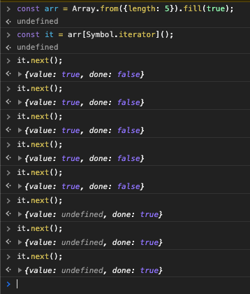
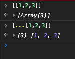

# 배열로 데이터 컬렉션을 관리하라

```text
created: 2020-09-14 22:23:00
updated: 2020-09-14 22:23:00
```

```text
<Quiz>
  1. 이터러블 프로토콜을 따르고 있다는 것이 무슨 뜻인가.
  2. 이터러블은 무엇인가요.
  3. 객체를 순회하는 방법을 말하시오.
  4. indexOf의 단점과 그에 대한 해결책을 말하시오.
  5. 배열에 값을 추가 삭제 등을 할 때, 사이드 이펙트를 줄일 수 있는 방법을 말하시오.
  6. sort()는 기존 배열을 조작하나요.
</Quiz>
```

## 배열로 유연한 컬렉션을 생성하라

### 펼침 연산자를 이용하여 배열을 새로 만들어서 조작하면 기존 배열에 건들지 않을 수 있다

예로 `return [...items].sort()`

이건 코테에서도 유용하게 쓰고 있다.

어떤 배열의 크기만큼 배열을 생성하고 `false`로 초기화한다고 하면

`const copyArr = [...arr].map(v => false)`으로 만들어 사용할 수 있다.

그 외 `Array.from({length: arr.length}).fill(false);`을 통해서 만들 수도 있지만, 위를 사용하는게 더 편하다.

> 참고자료

- [Array.from](https://developer.mozilla.org/ko/docs/Web/JavaScript/Reference/Global_Objects/Array/from)

### 배열은 이터러블 프로토콜을 따르고 있다

배열이 이터러블 프로토콜을 따르고 있다는 뜻은 무엇을 의미하는 가~

배열은 매서드로 `Symbol.iterator`를 키로 하는 함수를 가지고 있다는 의미이다. 즉 이를 배열에 이터러블이 내장되어있다고 표현한다.

이터러블을 따르는 자료 같은 경우에는 map, filter, reduce를 이용하여 간편하게 데이터를 조작할 수 있다.

그러면 이터러블이란 무엇인가 간단하게 적어보자.

이터러블 : 컬렉션의 현재 위치를 알고 있는 상태에서 컬렉션의 항목을 한 번에 하나씩 처리하는 방법



> 참고자료

- [Symbol.iterator](https://ko.javascript.info/iterable#ref-366)

> 팁

- 객체를 순회하려면 `Object.keys()`와 `Object.entries()`를 이용하자.
- 또는 lodash의 forEach를 이용하여 간단하게 사용할수도 있다.

<iframe src="https://codesandbox.io/embed/young-bash-u1k7q?autoresize=1&fontsize=14&theme=dark"
     style="width:100%; height:300px; border:0; border-radius: 4px; overflow:hidden;"
     title="young-bash-u1k7q"
     allow="accelerometer; ambient-light-sensor; camera; encrypted-media; geolocation; gyroscope; hid; microphone; midi; payment; usb; vr; xr-spatial-tracking"
     sandbox="allow-forms allow-modals allow-popups allow-presentation allow-same-origin allow-scripts"
   ></iframe>

## includes()로 존재 여부를 확인하라

ES6+ 이전에는 배열 또는 문자열을 indexOf()를 통해 값의 위치를 파악했다.

그런데 indexOf()의 문제점이 있었다.

만약 첫번째 위치인 `pos`가 0 일 때, 0은 falsy 값이라 조건문에서 false로 간주하게 되어 주의해야했어야했다.

그 대안으로 ES6+부터는 includes()가 나왔다.

includes()의 반환값은 boolean값으로 나와서 0일 때 안전하게 사용할 수 있다.

### 레퍼런스

- [String의 indexOf](https://developer.mozilla.org/ko/docs/Web/JavaScript/Reference/Global_Objects/String/indexOf)
- [Array의 indexOf](https://developer.mozilla.org/ko/docs/Web/JavaScript/Reference/Global_Objects/Array/indexOf)

## 펼침 연산자로 배열을 본떠라

자바스크립트에서 배열은 객체이다.

객체는 참조형이기 때문에 복사했을 때, 참조 주소값을 복사하게 된다.

그래서 복사된 변수값을 변경하게 되면 원래 값도 변경되게 된다.

그래서 이런 경우 조작(mutation)과 부수효과(side effect)로 인한 문제가 발생할 수 있다.

이게 무슨 말이냐면, 내가 복사된 배열을 조작했는데.. 예기치 않게 원본 배열이 변경이 되어서 문제가 생기는 것이다.

그래서 펼침 연산자[...]를 이용해서 배열값을 복사하게 되면 새로운 배열이 만들어져 사용할 수 있다.

이럴 경우 조작과 부수효과를 막을 수 있다.

사이드 이펙트를 일으키기 딱 좋은 메서드들이 있다.

`splice()`과 `push()`, `unshift()`, `shift()`, `pop()` 등이 있다.

### 팁

펼침 연산자의 추가적 기능으로 배열에 포함된 항목을 목록으로 바꿔준다.



## push() 대신 펼침 연산자로 원본 변경을 피하라

위에서도 말했지만, push()는 사이드 이펙트를 발생시킨다.

값을 넣을 때, 여러가지 방법이 있겠지만

`[...arr, 10]` 이렇게 데이터를 추가해도 되고,

`arr.slice()`를 통해 배열을 복사하고 `push()`를 사용하면 된다.

## 펼침 연산자로 정렬에 의한 혼란을 피하라

이건 기본적으로 `sort()`는 배열을 조작하게 된다.

그래서 보통 나는 `[...arr].sort()`를 사용하고 있다.

(그런데 펼침연산자 성능은 한 번쯤 의심해봐야하는데..)

## 기타

### TC39 위원회

자바스크립트 명세를 결정하는 위원회를 말한다.

검토 단계들이 있는데, 스테이지1, 스테이지2 등으로 부르고 있다.
