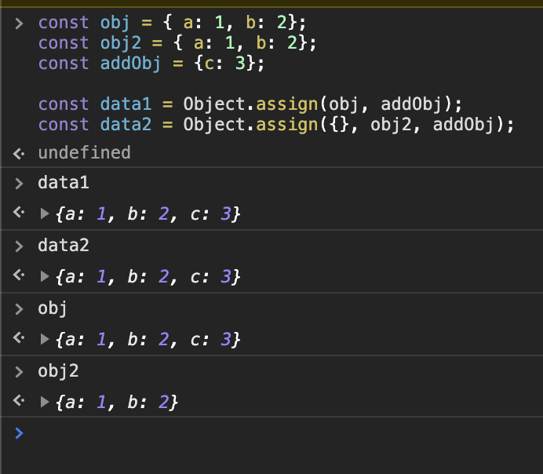
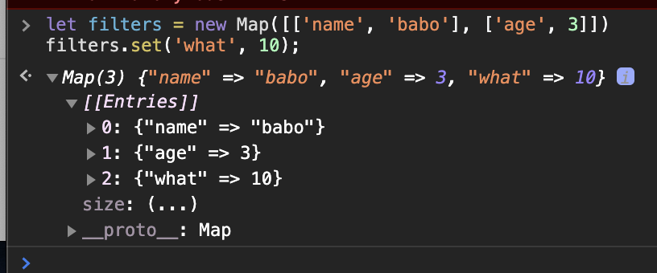

# 특수한 컬렉션을 이용해 코드 명료성을 극대화하라

```text
created: 2020-09-15 13:00:00
updated: 2020-09-15 13:00:00
```

```text
<Quiz>
  1. 객체를 복사할 때, 중첩된 객체를 피하는 방법 3가지를 말하시오.
  2. 1번에 해당하는 답인 객체 펼침 연산자를 이용한다고 했을 때, 발생할 수 있는 문제점이 무엇이 있을까요.
  3. Map이 가지고 있는 메서드와, Set이 가지고 있는 메서드는 무엇이 있나요.
  4. Map은 이터러블을 따르기 때문에 순회가 가능한데, 순회 순서가 보장되나요.
  5. 객체는 순회 순서가 보장되나요.
</Quiz>
```

> 특수한 컬렉션
> 자료들을 담아 놓을 수 있게 만든 객체, Set, Map 같은 것들이다.

## 객체를 이용해 정적인 키-값을 탐색하라

객체가 정적인 정보에 적합하다.

프로그래밍적으로도 객체를 생성해서 사용할 수 있다.

## Object.assign()으로 조작 없이 객체를 생성하라

중첩된 객체를 피하는 방법 세가지가 있다.

첫번째, Object.assgin()을 이용하는 방법인데, 많이 쓰는 방법이였다? (지금은 펼침연산자를 더 많이 쓰는 듯하다)

```js

const obj = { a: 1, b: 2};
const obj2 = { a: 1, b: 2};
const addObj = {c: 3};

const data1 = Object.assign(obj, addObj);
const data2 = Object.assign({}, obj2, addObj);
```

위 data1과 data2의 차이를 알아야한다.

data1은 기존 obj에 프로퍼티(c:3)을 추가하여 obj가 변경하게 된다.

반대로 data2는 Object.assign()의 첫 인자로 {}(빈 리터럴객체)를 두어서 obj2를 조작하지 않고,
새로운 객체에 저장하게 된다.



두번째, lodash 라이브러리 `cloneDeep()`사용하는 방법이 있다.

세번째, 객체 펼침 연산자를 이용하면 된다.

### 참고

- [Object.assign](https://developer.mozilla.org/ko/docs/Web/JavaScript/Reference/Global_Objects/Object/assign)
- [_.cloneDeep](https://lodash.com/docs/4.17.15#cloneDeep)

## 객체 펼침 연산자로 정보를 갱신하라

```js
const data = [10,20];

const new_data = [...data, 30];
```

어쨋든 간에 깊은 복사는 똑같이 처리해줘야함, 단지 보기 편할 뿐..

## 맵(Map)으로 명확하게 키-값 데이터를 갱신하라

```js
let filters = new Map([['name', 'babo'], ['age', 3]])
filters.set('what', 10);
```



키-값 쌍이 자주 추가되거나 삭제되는 경우 사용하면 좋다. 객체에서는 키를 지우기가 번거롭다.

키가 문자열이 아닌 경우에도 유용하게 쓰일 수 있다. 객체는 키값으로 문자열과 Symbol만 받는다.

추가는 set(key, value)로 이용하면 되고,

제거는 delete(key)를 이용하면 된다.

모두 제거하는 방법은 clear()를 이용하면 된다.

객체의 키가 숫자 일경우 유용함

> 팁

Map을 하나의 요소로 접근해 생각해보기

## 맵과 펼침 연산자로 키-값 데이터르 순회하라

Map은 이터러블을 따른다. 그래서 순회가 가능한데, 전 챕터에서 `Object.keys()`로 순회가 가능하다고 말했었다.

(참고로 객체에서는 순회 순서가 보장되지 않는다.)

맵은 `for of`으로 키와 값을 동시에 뽑아내서 사용할 수 있다.

또한

맵에 펼침 연산자를 이용해서 배열로 만들고 그걸 가지고 정렬 할 수 있다.

## 맵 생성 시 부수 효과를 피하라

`Map([...v, ...map])`과 같이 복사본을 만들 수가 있고 여러 개의 맵을 합칠 수도 있다.

## 세트를 이용해 고윳값을 관리하라

`reduce()`의 두번째 파라미터 초기값으로 `new Set()` 도 가능하다.

```js
const arr = [1, 2, 3, 3];
const output = arr.reduce((acc, value) => acc.add(value), new Set()); // Set(3) {1, 2, 3}
```
