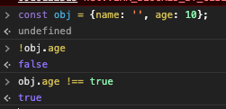

# 조건문을 깔끔하게 작성하라

```text
created: 2020-09-16 12:04:00
updated: 2020-09-16 12:04:00
```

```text
<Quiz>
  1. 동등과 일치의 차이는 무엇인가.
  2. 거짓 값들은 무엇이 있나요.
  3. 객체와 배열이 비어있는지 확인하는 방법은 무엇이 있나요.
  4. 삼항 연산자의 이점은 무엇인가요.
  5. 단락 평가의 이점이 무엇인가요.
</Quiz>
```

## 거짓 값이 있는 조건문을 축약하라

동등과 일치의 차이 알고 있어야 한다.

간단하게, == 은 동등비교, === 일치비교이다.

> 동등 관계

빈 문자열은 false 값에 동등이지만 일치하지 않음

```js
'' == false // true
'' === false // false
```

> 거짓 값들(falsy values) - 업데이트 20.09.17

- false
- null
- 0
- NaN
- ''(빈문자열)
- ""(빈문자열)
- -0 -> 추가
- 0n -> 추가
- undefined -> 추가

객체와 배열 같은 경우, 빈 배열과 빈 객체는 거짓 값이 아니다.

> 객체와 배열이 비어있는지 확인하는 방법

객체는 `Object.keys({}).length` 로 구함

배열은 `[].length` 로 구함

> 작지만 큰 차이

```js
!object.name
하고
object.name !== true

```

둘 다 결과값은 true가 된다.

하지만, 둘의 차이점은

전자는 falsy한 값을 뽑는거고 후자는 true빼고 다 뽑는 것이다.



## 삼항 연산자로 빠르게 데이터를 확인하라

삼항연산자를 썻을 때, 유효 범위 충돌을 줄 일 수 있다.

예로)

```js
let names;

if (firstname === '김') {
    names = ['김땡땡', '김나라'];
} else {
    names = ['아무개'];
}
// 유효범위가 5줄 정도 이상
를

let names = firstname === '김' ? ['김땡땡', '김나라'] : ['아무개']; // 유효 범위가 1줄로 끝
```

또한 코드를 줄일 수 있다.

삼항연산자가 중첩이 되어가면 그냥 조건문 쓰는게 가독성에 좋다.

## 단락 평가를 이용해 효율성을 극대화하라

단락평가는 && 또는 || 로 평가하는 방법을 말한다.

배열에 값이 있는지 차근차근히 체크할수도있고

기본값을 넣을 수 있다는 장점이 있다.

```js
function makeName(name) {
    let madeName = name || '아무개';
}

위 방법보다 요즘에는 기본값 함수 매개변수를 이용해서 값을 전달 할 수 있다.

function makeName(name = '아무개') {
    let madeName = name;
}

// 익스프로러는 지원 안함!
```
